  <picture>
    <source media="(prefers-color-scheme: dark)" srcset="./assets/dark.svg">
    <source media="(prefers-color-scheme: light)" srcset="./assets/light.svg">
    
  </picture>

 

  
# Arianna Mora Villarreal
**Ingeniería de Sistemas | Backend · Redes · Explorando DevOps**

<a href="mailto:ariannamora.tech@gmail.com">
  ariannamora.tech@gmail.com
</a>

---

Soy estudiante de Ingeniería de Sistemas en el Politécnico Grancolombiano, con interés principalmente en el desarrollo **Backend**, las **redes de datos** y las tecnologías relacionadas con **DevOps**.

Actualmente estoy fortaleciendo mis conocimientos en desarrollo de APIs, bases de datos, programación y redes. También estoy explorando herramientas relacionadas con contenedores, automatización, infraestructura y buenas prácticas de desarrollo.

Me gusta aprender nuevas tecnologías, resolver problemas y trabajar en equipo. Busco oportunidades de práctica o posiciones junior donde pueda aplicar mis conocimientos, adquirir experiencia profesional y seguir desarrollándome en el área de tecnología.

---

## Formación

### Ingeniería de Sistemas

**Politécnico Grancolombiano**
Medellín, Colombia

Durante mi formación he trabajado diferentes áreas relacionadas con desarrollo de software, bases de datos, sistemas operativos, redes y fundamentos de infraestructura.

### Formación CCNA

Cuento con formación en los siguientes módulos:

* Introduction to Networks
* Switching, Routing, and Wireless Essentials
* Enterprise Networking, Security, and Automation

También me encuentro fortaleciendo mi nivel de inglés, especialmente en contextos técnicos y profesionales.

---

# Proyectos

<table>
<tr>

<td width="33%" valign="top">

### TurboAdmin

Sistema web para la gestión integral de TurboCajas, actualmente en desarrollo.

**Funcionalidades**

* Gestión de vehículos
* Gestión de clientes
* Servicios
* Repuestos
* Órdenes de trabajo
* Facturación
* Dashboard

**Tecnologías**

`Python` `FastAPI` `TypeScript` `React` `Bootstrap` `TiDB`

 

<a href="https://github.com/ariannamorav/TurboAdmin">
  Ver proyecto
</a>

</td>

<td width="33%" valign="top">

### FastAPI + PostgreSQL CRUD API

REST API desarrollada con FastAPI y PostgreSQL para la gestión de usuarios mediante operaciones CRUD.

Implementa validación con Pydantic, comunicación con PostgreSQL mediante Psycopg, variables de entorno, documentación automática con Swagger/OpenAPI y ejecución mediante Uvicorn.

**Tecnologías**

`Python` `FastAPI` `PostgreSQL` `Psycopg` `Pydantic` `Uvicorn` `python-dotenv`

 

<a href="https://github.com/ariannamorav/fastapi-postgresql-crud-api">
  Ver proyecto
</a>

</td>

<td width="33%" valign="top">

### Sistema de Gestión Hospitalario

Proyecto académico desarrollado en Java y MySQL, orientado a la aplicación de conceptos de programación y fundamentos de bases de datos.

**Tecnologías**

`Java` `MySQL` `XAMPP` `NetBeans`

  

<a href="https://github.com/ariannamorav/Sistema-de-Gesti-n-Hospitalario">
  Ver proyecto
</a>

</td>

</tr>
</table>

---

# Tecnologías

### Backend

  

`Python` · `FastAPI` · `Java`

### Frontend

  

`TypeScript` · `React` · `Bootstrap`

### Bases de Datos

  

`PostgreSQL` · `TiDB` · `MySQL`

### Herramientas

  

`Docker` · `Git` · `GitHub` · `Linux` · `Uvicorn` · `Swagger/OpenAPI`

### Redes

`Cisco` · `CCNA` · `GNS3` · `Wireshark`

---

# Redes

Además del desarrollo de software, tengo interés en redes de datos e infraestructura.

Durante mi formación he realizado laboratorios utilizando GNS3, Cisco y máquinas Linux para trabajar diferentes escenarios de comunicación y analizar el comportamiento de una red.

Algunos de los conceptos que he trabajado incluyen:

* TCP/IP
* Switching
* Routing
* VLAN
* EtherChannel
* LACP
* Balanceo de carga
* GNS3
* Wireshark
* iPerf3

Esta área me interesa especialmente porque permite comprender cómo se comunican las aplicaciones y cómo interactúan el software, las redes y la infraestructura.

---

# Contacto

Si quieres conocer más sobre mí, mis proyectos o mi proceso de aprendizaje, puedes encontrarme en los siguientes perfiles:

